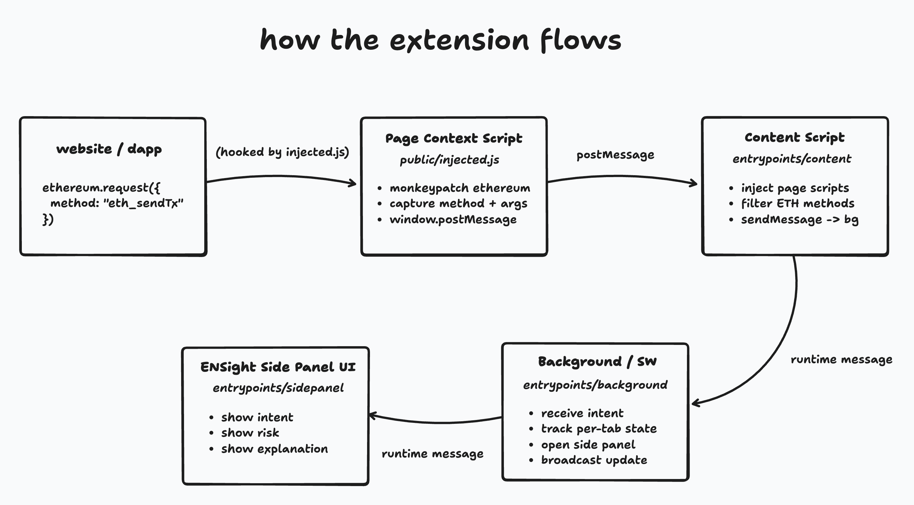

  

<h1 align="center">ENSight Extension</h1>

  Real-time perception layer for Ethereum — intercepting wallet actions and explaining intent, risk, and context.

  
  
  

---

## 🔄 Extension User Flow

  

### How it works

1. User visits a website  
2. Website injects a wallet (`window.ethereum`)  
3. ENSight hooks into the page runtime  
4. Website calls `ethereum.request(...)`  
5. ENSight intercepts method + parameters  
6. Intent is forwarded to the background worker  
7. ENSight side panel opens automatically  
8. ENSight explains what’s about to happen (action, risk, context)

---

## ⚙️ Tech Stack

- WXT  
- Chrome Extension APIs  
- Runtime interception hooks  
- Background workers  

---

## 🎯 Role in ENSight

This repository contains the **client perception layer** of ENSight — responsible for detecting wallet activity, intercepting transaction intent, and presenting real-time context to users.

---

## 🚀 Why ENSight

ENSight acts as a **real-time safety + context layer for Web3**, giving users clarity before they sign, approve, or interact with smart contracts.

- Inline transaction explanations  
- Scam & abnormal behavior detection  
- Human-readable wallet intent  

